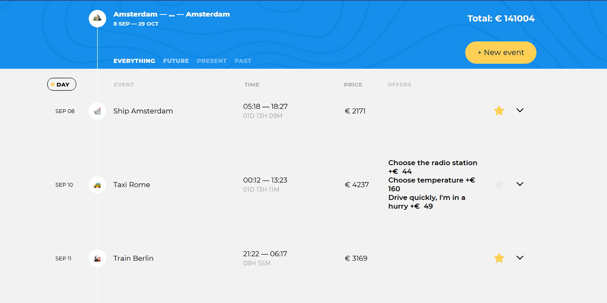

# Проект «Большое путешествие» от [HTML Academy](https://htmlacademy.ru/)

«Большое путешествие» — современный сервис для настоящих путешественников. Сервис помогает детально спланировать маршрут поездки, рассчитать стоимость путешествия и получить информацию о достопримечательностях. Минималистичный интерфейс не даст повода отвлечься и сфокусирует внимание на планировании путешествия.

Программирование: [Андрей Грачев](https://github.com/andreysgra/)

[Демо проекта](https://big-trip-service.vercel.app/)

[Техническое задание](Specification.md)

## Используемый стек

JavaScript (ES6). Проект разработан в соответствии с архитектурным паттерном MVP.

## Как использовать

`npm install` – установка зависимостей.

`npm start` – сборка проекта в режиме разработки и запуск локального сервера.

`npm run build` – финальная сборка проекта.

`npm run lint` – запуск теста на соответствие правилам ESLint.
